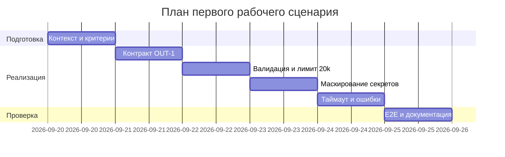

# План поставки

## Инкременты и ответственность

| Инкремент | Наблюдаемый результат | Что делает человек | Что делает AI или субагент | Проверка | Зависимости |
|---|---|---|---|---|---|
| 1. Контракт OUT-1 | Ответ сервиса строго в формате OUT-1: `summary`, `risks` (≤3 c `file/line/evidence/risk`), `checks` | Утверждает схему и граничные случаи; проводит ревью | Предлагает схему и примеры валидных/невалидных ответов; генерирует черновик контракт-тестов | DoD: OUT-1 зафиксирован; [tests_unit.md](../../practice_01/tests_unit.md) (OUT-1) — зелёные; [tests_integration.md](../../practice_01/tests_integration.md) «API -> ReviewService» — ответ соответствует OUT-1; метрика из [problem.md](../../practice_01/problem.md): «Доля ответов в формате OUT-1» — целевой порог ≥95% отражён в DoD | [CASE.md](../../practice_01/CASE.md): OUT-1 |
| 2. Валидация входа и лимит 20 000 (API-1) | Запросы с `diff` > 20 000 символов отклоняются с HTTP 413; отсутствие `diff` — предсказуемая ошибка валидации | Уточняет формат ошибки и коды; ревьюит негативные кейсы | Генерирует негативные кейсы и граничные диффы 19–21k | DoD: лимит 20k и валидация реализованы; [tests_unit.md](../../practice_01/tests_unit.md) (API-1) — зелёные; [tests_integration.md](../../practice_01/tests_integration.md) — 413 для >20k; [tests_load.md](../../practice_01/tests_load.md) «Граничный размер diff» — 413 стабильно; метрика из [problem.md](../../practice_01/problem.md): «Доля отклонённых слишком длинных diff» = 100% | [CASE.md](../../practice_01/CASE.md): API-1; инкр. 1 |
| 3. Маскирование секретов (SEC-1) | Перед отправкой во внешний LLM секреты заменяются на `[REDACTED]`; в ответах и логах секретов нет | Определяет паттерны маскировки и источники потенциальных секретов; выборочная проверка | Предлагает шаблоны redaction и тестовые примеры секретов | DoD: маскирование активно; [tests_integration.md](../../practice_01/tests_integration.md) «ReviewService -> Masking» — evidence `[REDACTED]`; [tests_e2e.md](../../practice_01/tests_e2e.md) — в ответе и артефактах секретов нет | [CASE.md](../../practice_01/CASE.md): SEC-1; инкр. 1–2 |
| 4. Таймаут 10s и контролируемая ошибка (REL-1) | LLM-вызов ограничен 10 сек; при превышении — предсказуемая ошибка без падения API | Выбирает стратегию таймаута/ретраев и формат ошибки | Готовит обработку ошибок и тест-кейсы отказа (задержка >10s) | DoD: таймаут 10s реализован; [tests_integration.md](../../practice_01/tests_integration.md) «LLM timeout >10s» — API отвечает контролируемо; [tests_load.md](../../practice_01/tests_load.md) — под нагрузкой стабильность ответа; метрика из [problem.md](../../practice_01/problem.md): «Доля запросов с корректной обработкой таймаута LLM» ≥99% | [CASE.md](../../practice_01/CASE.md): REL-1; инкр. 1–3 |
| 5. Документация и E2E | Сквозной сценарий «API -> ReviewService -> OUT-1» проходит; ограничения (20k, 10s) и формат описаны | Сверяет артефакты между собой, финализирует документацию | Генерирует черновики разделов и E2E-сценариев | DoD: [tests_e2e.md](../../practice_01/tests_e2e.md) — сценарии (позитивный/негативный/граничный) описаны и воспроизводимы; ссылки на [CASE.md](../../practice_01/CASE.md) и метрики [problem.md](../../practice_01/problem.md) консистентны; все предыдущие DoD учтены | Инкр. 1–4 |

## Диаграмма Ганта

## Как использовали AI

- Для чего: собрать факты из [CASE.md](../../practice_01/CASE.md) и метрики из [problem.md](../../practice_01/problem.md), сопоставить их с проверками [tests_unit.md](../../practice_01/tests_unit.md), [tests_integration.md](../../practice_01/tests_integration.md), [tests_load.md](../../practice_01/tests_load.md), [tests_e2e.md](../../practice_01/tests_e2e.md) и сформировать DoD без выдуманных допущений
- Тип промпта: Retrieval-Augmented Generation (источники — артефакты Практики 1)
- Строка в [prompts.md](../prompts.md): RAG — [rag/experiment.md](experiment.md)
- Что проверили и исправили сами: исключили плейсхолдеры из шаблона; числа оставили только где заданы правилами (≥95%, 100%, ≥99%, 20 000, 10s); ссылки ведут на реальные файлы `practice_01`; не заявляли факт прохождения тестов, только критерии DoD
