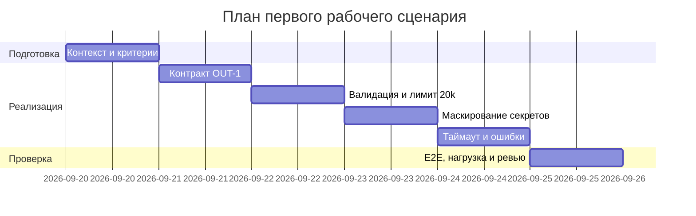

# План поставки

## Инкременты и ответственность

| Инкремент | Наблюдаемый результат | Что делает человек | Что делает AI или субагент | Проверка | Риски и меры | Зависимости |
|---|---|---|---|---|---|---|
| 1. Контракт OUT-1 | Ответ ReviewService строго в формате OUT-1: `summary`, `risks` (≤3 c `file/line/evidence/risk`), `checks` | Утверждает схему ответа и граничные случаи; ревьюит контракт | Генерирует черновик схемы, примеры валидных/невалидных ответов и контракт-тесты | DoD: [tests_unit.md](../../practice_01/tests_unit.md) (OUT-1) и [tests_integration.md](../../practice_01/tests_integration.md) «API -> ReviewService» зелёные; метрика [problem.md](../../practice_01/problem.md) «Доля ответов в формате OUT-1» ≥95% | Риск: текущий код возвращает `{"comment": ...}` (см. `app/review_service.py:22`, P1-02) — потребители получат неструктурированный ответ. Мера: контрактный тест блокирует релиз | [CASE.md](../../practice_01/CASE.md): OUT-1, QA-1; TRAINING_PR.diff |
| 2. Валидация входа и лимит 20k (API-1) | Отсутствие `diff` в payload — внятная ошибка валидации; `diff` > 20 000 символов — HTTP 413 | Уточняет формат ошибки и коды ответов | Генерирует негативные кейсы и граничные диффы 19–21k | DoD: [tests_unit.md](../../practice_01/tests_unit.md) (API-1, «Наличие поля diff») зелёные; [tests_load.md](../../practice_01/tests_load.md) «Граничный размер diff» — 413 стабильно; метрика «Доля отклонённых слишком длинных diff» = 100% | Риск: KeyError на `payload["diff"]` роняет обработчик (`app/api.py:37`, P1-02). Мера: негативный unit-тест на payload без `diff` | [CASE.md](../../practice_01/CASE.md): API-1; инкр. 1 |
| 3. Маскирование секретов (SEC-1) | Токены, пароли и приватные ключи заменяются на `[REDACTED]` до отправки во внешний LLM | Определяет паттерны маскировки и проводит выборочную проверку логов | Предлагает шаблоны redaction и тестовые примеры секретов | DoD: [tests_integration.md](../../practice_01/tests_integration.md) «ReviewService -> Masking» — в prompt и логах `[REDACTED]`; [tests_e2e.md](../../practice_01/tests_e2e.md) — секретов нет в ответе | Риск: diff уходит в LLM без очистки (`app/review_service.py:20`, P1-02) — утечка секретов третьей стороне. Мера: интеграционный тест с тестовым token как релизный гейт | [CASE.md](../../practice_01/CASE.md): SEC-1; инкр. 1–2 |
| 4. Таймаут 10s и контролируемая ошибка (REL-1) | LLM-вызов ограничен 10 сек; при превышении — предсказуемый ответ об ошибке, API не падает | Выбирает стратегию таймаута и формат ошибки | Готовит обработку ошибок и тест-кейсы отказа (задержка >10s) | DoD: [tests_integration.md](../../practice_01/tests_integration.md) «LLM timeout >10s» зелёный; [tests_load.md](../../practice_01/tests_load.md) — успешные ответы ≥99%, p95 < 1s; метрика «Доля запросов с корректной обработкой таймаута LLM» ≥99% | Риск: без таймаута зависший LLM блокирует воркеры и весь API (`app/review_service.py:21`, P1-02). Мера: нагрузочный сценарий с моделируемой задержкой | [CASE.md](../../practice_01/CASE.md): REL-1; инкр. 1–3 |
| 5. Документация и E2E | Сквозной сценарий «API -> ответ OUT-1» проходит; ограничения (20k, 10s) и формат описаны в доке | Сверяет артефакты между собой, финализирует документацию | Генерирует черновики разделов и E2E-сценариев | DoD: все три сценария [tests_e2e.md](../../practice_01/tests_e2e.md) (позитивный, негативный, граничный) проходят; ссылки на [CASE.md](../../practice_01/CASE.md) и метрики [problem.md](../../practice_01/problem.md) консистентны | Риск: расхождение доки и поведения сервиса — ложные ожидания потребителей. Мера: E2E-прогон на TRAINING_PR.diff перед сдачей | Инкр. 1–4 |

## Диаграмма Ганта

## Как использовали AI

- Для чего: заполнить план поставки по шаблону — вывести инкременты из правил [CASE.md](../../practice_01/CASE.md) (OUT-1, API-1, SEC-1, REL-1), привязать DoD к [tests_unit.md](../../practice_01/tests_unit.md), [tests_integration.md](../../practice_01/tests_integration.md), [tests_load.md](../../practice_01/tests_load.md), [tests_e2e.md](../../practice_01/tests_e2e.md) и метрикам [problem.md](../../practice_01/problem.md), добавить явные риски с evidence из P1-02
- Тип промпта: R.C.T.F. (Role, Context, Task, Format)
- Строка в [prompts.md](../prompts.md): R.C.T.F. — [rctf/experiment.md](experiment.md); исходные данные — P1-02, P1-03
- Что проверили и исправили сами: каждая ссылка `file:line` в колонке «Риски и меры» сверена с журналом P1-02 и TRAINING_PR.diff; пороги (20 000 символов, 10 сек, ≥95%, ≥99%, 100%) взяты дословно из CASE.md и problem.md; владельцев не указывали — в источниках нет данных о людях; «тесты зелёные» — критерий приёмки, а не факт прогона
