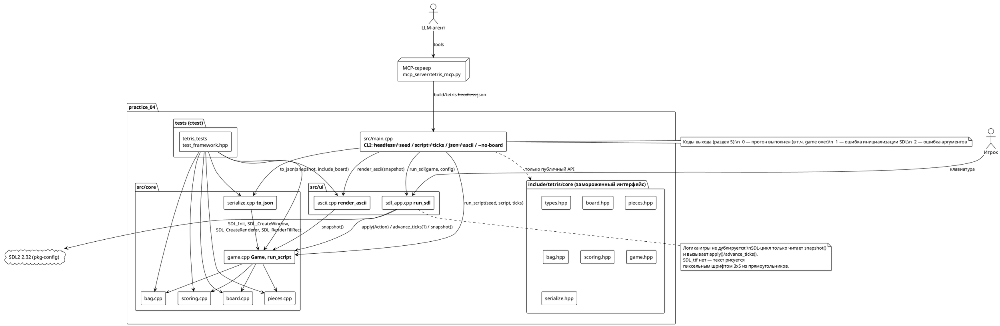

# Архитектура Tetris (practice_04)

Документ описывает слои продукта, поток данных и границы ответственности.
Спецификация поведения — `docs/spec.md`, контракт работы агентов — `AGENTS.md`.

---

## 1. Слои

| Слой | Каталог | Зависит от | Отвечает за |
|---|---|---|---|
| Ядро | `include/tetris/core`, `src/core` | только стандартная библиотека | правила игры: поле, фигуры, SRS-вылеты, 7-bag, гравитация, lock delay, hold, очки, T-spin |
| Сериализация | `src/core/serialize.cpp` | ядро | `GameSnapshot` → JSON (схема раздела 6 `docs/spec.md`) и `board_hash` |
| ASCII-рендер | `src/ui/ascii.cpp` | ядро | `GameSnapshot` → человекочитаемое поле (`--ascii`, MCP `tetris_render`) |
| CLI | `src/main.cpp` | ядро, сериализация, ASCII, SDL-фронтенд | разбор аргументов раздела 5, headless-прогон, коды выхода |
| SDL-фронтенд | `src/ui/sdl_app.cpp` | SDL2, ядро | окно, ввод с клавиатуры, отрисовка, HUD |
| MCP | `mcp_server/tetris_mcp.py` | собранный `build/tetris` | инструменты-обёртки над CLI для агента |

Ключевое ограничение: ядро не знает про SDL и не печатает в stdout. UI-слои
работают только на чтение — им доступен `Game::snapshot()`, `Game::apply()`,
`Game::advance_ticks()` и `Game::reset()`. Заголовки в `include/tetris/`
заморожены: сигнатуры меняет только архитектор (человек).

## 2. Поток данных

Ввод приходит из одного из двух источников и сходится в одной точке — `Game::apply()`:

- headless: строка `--script "L2CWHOLDHDT30"` разбирается в токены
  (`action_from_token`, `action_repeat_from_token`) и применяется к ядру;
  после каждого токена выполняется один тик гравитации (`T` сам является тиком);
- SDL: `SDL_KEYDOWN` в `sdl_app.cpp` отображается на `Action` (стрелки, X/Z/A,
  Space, C/LShift, R, P, Esc/Q), а `Game::advance_ticks(1)` вызывается из
  игрового цикла с частотой `config.fps`.

```text
ввод (скрипт | SDL-событие)
        │
        ▼
   Game::apply(Action)  ──►  Game::advance_ticks(1)
        │
        ▼
   Game::snapshot() : GameSnapshot
        │
        ├──► to_json()       ──► stdout (--json, по умолчанию в headless)
        ├──► render_ascii()  ──► stdout (--ascii) / MCP tetris_render
        └──► render_frame()  ──► окно SDL2 (призрак, hold, next, HUD)
```

Детерминизм держится на том, что единственный источник случайности — `PieceBag`
с явным `uint64_t seed` (xorshift64\*). При одинаковых `seed` и сценарии
`board_hash` совпадает побитово (AC-4.2).

## 3. Диаграмма компонентов



## 4. Сборка

- `CMakeLists.txt` — C++20, `-Wall -Wextra -Wpedantic`, две цели:
  - `tetris`: `src/main.cpp`, `src/ui/sdl_app.cpp`, `src/ui/ascii.cpp`, `src/core/*.cpp`; линкует SDL2;
  - `tetris_tests`: `tests/*.cpp`, `src/ui/ascii.cpp`, `src/core/*.cpp`; SDL2 не линкует.
- `src/core/*.cpp` и `tests/*.cpp` подключаются через `file(GLOB_RECURSE ... CONFIGURE_DEPENDS)`,
  чтобы конфигурация не падала на ещё не созданных файлах.
- `enable_testing()` + `add_test(NAME core COMMAND tetris_tests)` — тесты запускаются `ctest`.
- `Makefile` — обёртка (`build`, `test`, `sim`, `run`, `clean`, `help`).
