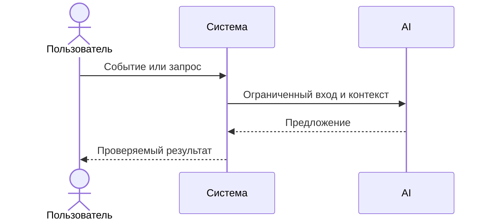

# Use cases и user stories

## Первый рабочий сценарий

Когда разработчик отправляет diff учебного PR, система принимает запрос POST `/api/reviews`, отправляет diff в LLM согласно правилам и возвращает `summary`, до 3 `risks` с evidence и `checks`, а пользователь получает стандартизованный ответ.

Не входит в этот сценарий:

- 

## Use case

| Поле | Значение |
|---|---|
| Актор | Ревьюер |
| Триггер | Поступил diff для анализа |
| Предусловия | Доступен сервис, соблюдены SEC-1, API-1 |
| Основной результат | Возвращён OUT-1 совместимый ответ |
| Ошибка или отказ | 413 при слишком длинном diff; контролируемая ошибка при timeout (REL-1) |



## User stories и acceptance criteria

```gherkin
Feature:

  Scenario: Позитивный
    Given вход содержит diff ≤ 20 000 символов
    When отправлен POST /api/reviews
    Then ответ содержит summary, risks (≤3) и checks

  Scenario: Негативный или граничный
    Given вход содержит diff > 20 000 символов
    When отправлен POST /api/reviews
    Then сервис возвращает 413
```

## Как использовали AI

- Для чего: описать сценарий использования, use case и acceptance criteria для кейса AI-reviewer.
- Тип промпта: Master prompt (P1-02).
- Строка в [`prompts.md`](prompts.md): P1-02.
- Что проверили и исправили сами: согласовали gherkin-сценарии с правилами OUT-1 и API-1; убрали предположения без evidence.
