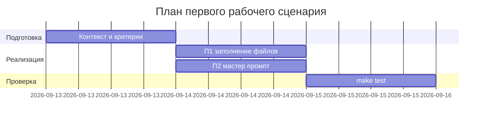

# План поставки

## Инкременты и ответственность

| Инкремент | Наблюдаемый результат | Что делает человек | Что делает AI или субагент | Проверка | Зависимости |
|---|---|---|---|---|---|
| 1 | Заполнены обязательные файлы (п.1) | Проверяет связность | Подсказывает структуру | `make test` OK | CASE.md |
| 2 | Обновлён мастер промпт (п.2) | Валидирует формат OUT-1 | Генерирует skeleton | P1-02 соответствует OUT-1 | P1-01 |
| 3 | Подготовлены шаблоны тестов | Определяет сценарии | Предлагает checks | Ручная проверка | контекст |

## Диаграмма Ганта

Замените даты и задачи на свой план.

## Как использовали AI

- Для чего: спланировать инкременты и роли людей/AI для выполнения пп. 1–2.
- Тип промпта: Master prompt (P1-02).
- Строка в [`prompts.md`](prompts.md): P1-02.
- Что проверили и исправили сами: связали инкременты с проверками (`make test`) и критериями оценки; уточнили зависимости.
